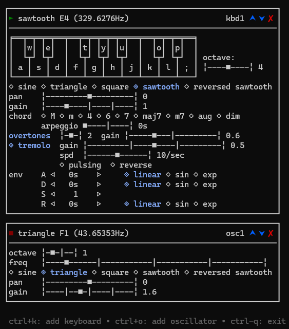

<H1>GO SYNTH</H1> 
Keyboard operated synthesizer that runs on a simple console

<H2>Features:</H2>
<ul>
    <li>Waveform</li>
    <li>Pan</li>
    <li>Gain</li>
    <li>Automatic Chords</li>
    <li>Overtones</li>
    <li>Tremolo</li>
    <li>ADSR Envelope</li>
    <li>Oscillator</li>
</ul>

<H2>Powered By:</H2>
<ul>
    <li><a href="https://github.com/gopxl/beep">Beep</a></li>
    <li><a href="https://github.com/charmbracelet/bubbletea">Bubble Tea</a></li>
    <li><a href="https://github.com/lrstanley/bubblezone">BubbleZone</a></li>
    <li><a href="https://github.com/charmbracelet/bubbles">Bubbles</a></li>
    <li><a href="https://github.com/charmbracelet/lipgloss">Lip Gloss</a></li>
</ul>
